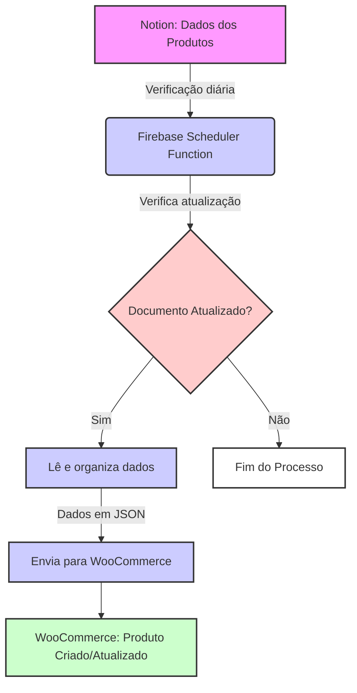

# Proposta de desenvolvimento

## Introdução

Este documento explica detalhadamente como integraremos o Notion, onde você gerencia informações dos produtos, ao WooCommerce, sua plataforma de e-commerce. Usaremos o Firebase Functions para automatizar essa conexão, garantindo que sua loja online seja atualizada diariamente com as informações mais recentes.

## Processo Detalhado de Integração

### Descrição do Processo

1. **Notion**: Você mantém os detalhes dos produtos, incluindo descrições, preços e fotos, atualizados em documentos no Notion.
2. **Firebase Scheduler Function**: Uma função programada é executada diariamente para verificar se houve atualizações nos documentos desde a última verificação.
3. **Verificação de Atualização**: A função determina se o documento foi marcado como atualizado.
4. **Processamento de Dados**:
   - Se o documento foi atualizado, uma função adicional é acionada para ler e organizar os dados do documento em um formato JSON.
   - Se não houver atualização, o processo termina.
5. **Envio para WooCommerce**:
   - O JSON formatado é enviado para a API do WooCommerce para criar ou atualizar os detalhes do produto na loja online.
6. **WooCommerce**: A plataforma de e-commerce recebe os dados e atualiza a loja conforme necessário.

## Benefícios do Firebase Functions

- **Automação e Eficiência**: As funções programadas garantem que sua loja esteja sempre atualizada sem intervenção manual.
- **Redução de Erros**: Automatizar o processo reduz os erros humanos associados à entrada de dados.
- **Escalabilidade e Flexibilidade**: O sistema pode facilmente escalar para lidar com um aumento no número de produtos ou mudanças mais frequentes.

## Custos de Execução

- Dada a configuração de chamadas diárias e o processamento baseado em atualizações documentais, o sistema é extremamente eficiente em termos de custo. A maioria das operações permanecerá dentro do limite gratuito oferecido pelo Firebase, com custos adicionais sendo mínimos e baseados apenas em uso excedente.
### Estimativa de Uso

Com um catálogo de 80 produtos, supondo que cada produto precise, em média, de 100 chamadas de função para manter todas as informações atualizadas (incluindo alterações de preço, descrição, estoque, etc.), teremos:

- **8,000 chamadas de função por mês** (80 produtos x 100 chamadas)

### Custo Previsto

O Firebase Functions tem um modelo de preços que oferece um número gratuito de invocações por mês. Além disso, cada 1 milhão de chamadas adicionais custa uma pequena taxa. Para uma estimativa precisa, consultaremos os preços atuais no momento do contrato. Aqui está um exemplo com base em uma estrutura de custos típica:

- **Primeiras 2 milhões de chamadas por mês são gratuitas**.
- **Cada 1 milhão de chamadas adicional**: $0.40.

Dada nossa estimativa de 8,000 chamadas por mês, o custo mensal pode se manter dentro do limite gratuito, dependendo de outros usos que você tenha para o Firebase no seu projeto.
## Conclusão

A integração automatizada entre o Notion e o WooCommerce via Firebase Functions simplifica a manutenção do catálogo de produtos da sua loja online, garantindo que as informações sejam sempre precisas e atuais. Esta solução não apenas economiza tempo, mas também melhora a eficiência operacional da sua loja.