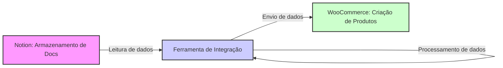

# Documentação do Projeto de Integração Notion-WooCommerce

## Finalidade

Este documento descreve a finalidade e a aplicação da ferramenta de integração entre o Notion e o WooCommerce. A ferramenta será desenvolvida com o objetivo de automatizar e otimizar o processo de cadastro de produtos no WooCommerce através da leitura e interpretação de documentos armazenados no Notion.

## Aplicação do Software

### Visão Geral

A ferramenta de integração Notion-WooCommerce facilita a gestão de produtos em uma loja WooCommerce ao permitir que informações de produtos, inicialmente formuladas e armazenadas em documentos no Notion, sejam automaticamente transferidas para o WooCommerce. Isso inclui a criação e atualização de produtos com metadados customizados, reduzindo significativamente o tempo e o esforço necessários para o gerenciamento de inventário.

### Funcionalidades Principais

1. **Leitura de Documentos do Notion**: O software acessa documentos especificados no Notion, que contêm informações detalhadas sobre produtos, incluindo descrições, preços, imagens, e outras especificações relevantes.

2. **Modelagem de Dados**: Após a leitura, o software formula um modelo de dados estruturado que representa eficientemente as informações dos produtos conforme necessário para o uso no WooCommerce.

3. **Integração com WooCommerce**: Utilizando a API do WooCommerce, o software envia os dados modelados para a plataforma, onde um novo produto é cadastrado automaticamente. Cada produto cadastrado pode conter diversos `post_meta` customizados, que são essenciais para a personalização e extensão das funcionalidades padrão do WooCommerce.

### Benefícios

- **Automação do Cadastro de Produtos**: Reduz a necessidade de entrada manual de dados, minimizando erros e economizando tempo.
- **Flexibilidade**: Permite a personalização de metadados de produtos, o que é crucial para lojas que necessitam de campos personalizados para melhor descrever seus produtos.
- **Escalabilidade**: Facilita a gestão de grandes volumes de produtos, tornando o software escalável conforme o crescimento da loja.

## Tecnologias Utilizadas

- **Notion API**: Para acessar e ler documentos.
- **WooCommerce REST API**: Para interagir com o WooCommerce, enviando dados e criando produtos.
- **Linguagens de Programação**: PHP, JavaScript, ou outras, dependendo das necessidades específicas de desenvolvimento e integração.

## Conclusão

Esta ferramenta representa uma solução inovadora para os vendedores que utilizam o WooCommerce e desejam melhorar a eficiência de suas operações de e-commerce. Com a integração direta do Notion para o WooCommerce, os usuários podem gerenciar seus produtos de maneira mais eficiente e com maior precisão.
