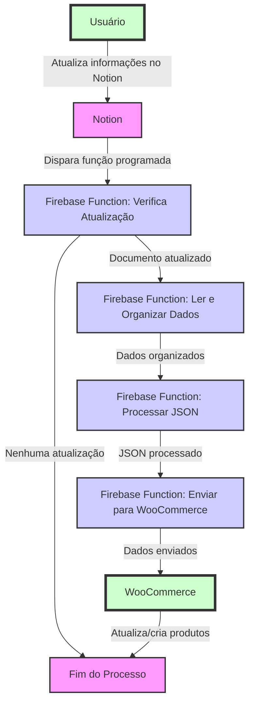

# Organização dos Documentos no Notion

### Estrutura dos Documentos

Os documentos no Notion que contêm informações sobre os produtos devem ser organizados de maneira padronizada para facilitar a automatização. Cada documento deve representar um único produto e conter todas as informações necessárias para atualizar esse produto no WooCommerce. Aqui estão os detalhes específicos sobre a estrutura:

1. **Título do Documento**:
   O título deve claramente identificar o produto, preferencialmente incluindo um código de identificação único.

2. **Corpo do Documento**:
   O corpo deve conter seções bem definidas para cada tipo de informação, como descrição, preço, categoria, tags, imagens e outras metainformações relevantes.

3. **Marcações de Atualização**:
  Cada documento deve ter uma maneira de marcar se precisa ser atualizado. Isso pode ser feito através de uma caixa de seleção ou um campo de data que indica a última modificação.

Para atualizar a parte de documentos sugeridos com os links fornecidos, você pode incluir referências a esses documentos específicos no Notion em sua documentação. Aqui está uma seção revisada que incorpora esses links:

## Documentos Sugeridos no Notion

Para garantir uma integração eficaz e manter a consistência nas informações do produto, recomendamos o uso dos seguintes documentos padrão no Notion, que servem como modelos para os dados dos produtos e o layout que serão utilizados na integração com o WooCommerce:

### Lista de Produtos

Este documento no Notion serve como o diretório principal para todos os produtos que serão gerenciados e sincronizados com o WooCommerce. Ele contém uma lista detalhada dos produtos, incluindo identificadores, descrições, preços, quantidades em estoque, e outras informações relevantes.

- **Acessar Documento da Lista de Produtos**: [Lista de Produtos no Notion](https://www.notion.so/prepeducacao/38c70ee40b254d348ca6e7b73e35e204?v=1d954407adab40ae9b87cf54497409e9)

### Layout de Produtos

Este documento detalha o layout e a estrutura que cada entrada de produto deve seguir no Notion. Ele é crucial para garantir que os dados sejam organizados de uma maneira que a integração possa processar eficientemente, incluindo a forma como as imagens e metadados devem ser apresentados.

- **Acessar Documento de Layout de Produtos**: [Layout de Produtos no Notion](https://www.notion.so/prepeducacao/Aprova-Professores-1de2e2e0cc954692986ea59cd5758229)

### Importância dos Documentos Padronizados

Utilizar esses documentos padronizados assegura que a transferência de informações do Notion para o WooCommerce seja realizada sem erros e de forma automatizada. Isso simplifica a manutenção do catálogo de produtos e minimiza o risco de inconsistências de dados ao atualizar a loja online.

Assegure-se de que esses documentos estejam sempre atualizados e reflitam as informações mais recentes dos produtos para maximizar a eficiência do processo de integração.

### Diretrizes para Manutenção

- Os documentos devem ser revisados e atualizados regularmente para garantir que as informações estejam corretas.
- As alterações nos documentos devem ser registradas adequadamente para ativar as funções de atualização.
- Uma estrutura clara e uniforme facilita a manutenção e reduz a probabilidade de erros durante a integração.

### Frequência de Atualização

Para garantir que as informações dos produtos sejam atualizadas regularmente e de forma eficiente no WooCommerce, a função que verifica atualizações nos documentos do Notion é configurada para ser executada em um intervalo de horas fixo. Especificamente, essa função é programada para rodar a cada algumas horas, conforme estabelecido de acordo com as necessidades do negócio. Isso assegura que quaisquer alterações feitas nos documentos do Notion sejam prontamente identificadas e processadas, minimizando atrasos na atualização dos produtos na loja online e maximizando a relevância das informações disponíveis para os clientes. Este intervalo de execução também ajuda a distribuir a carga de trabalho de maneira uniforme ao longo do dia, evitando picos de processamento e otimizando o uso dos recursos de computação.

## Caso de Uso: UML

Com a estrutura do documento definida, podemos criar um diagrama de caso de uso UML para ilustrar o processo de integração.

### Diagrama de Caso de Uso UML

### Descrição dos Casos de Uso

- **Verificar se o documento foi atualizado**: Este caso de uso envolve a função de agendamento diário que verifica se há marcações de atualização nos documentos do Notion.
- **Ler e Organizar os Dados**: Após a verificação, os dados são lidos e organizados em um formato JSON, preparando-os para serem enviados ao WooCommerce.
- **Processar JSON**: Transformação dos dados em um formato compatível com a API do WooCommerce.
- **Enviar para WooCommerce**: Envio dos dados processados para criar ou atualizar produtos na loja WooCommerce.